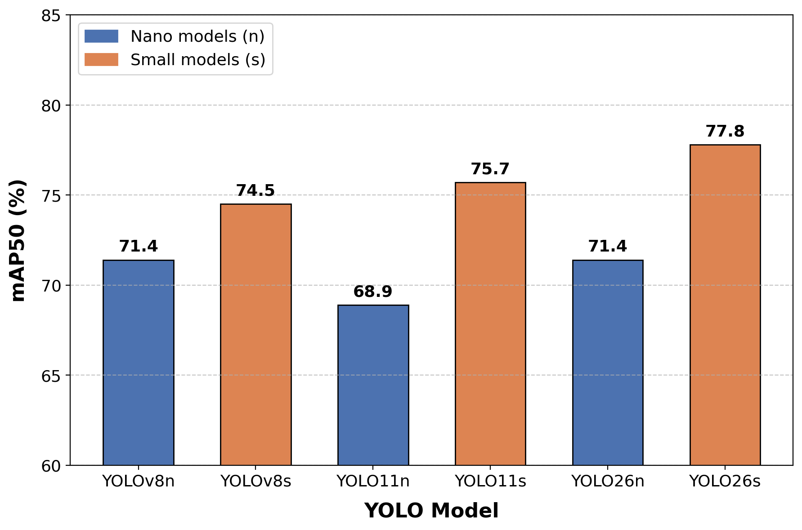
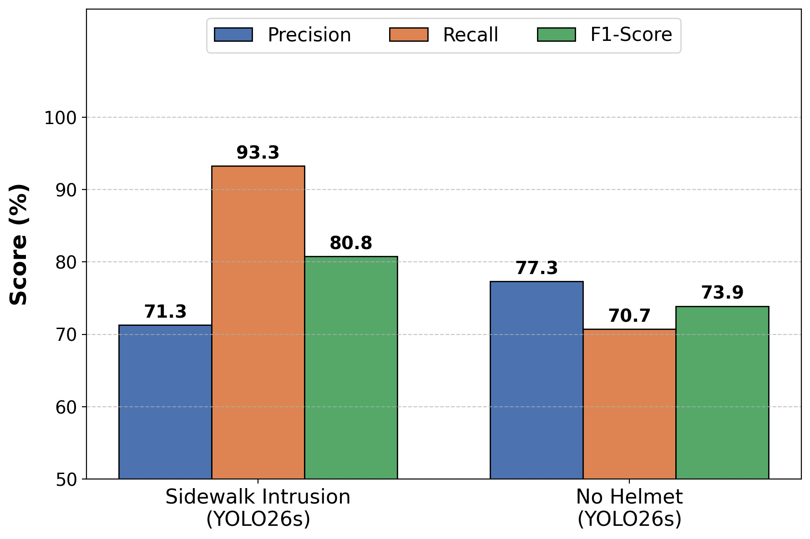

# Motorcycle Violation Detection

Real-time detection of two common motorcycle traffic violations from CCTV
footage: **riding on the sidewalk** and **riding without a helmet**. Built
on YOLO object detection and ByteTrack multi-object tracking.

The project compares six YOLO variants (YOLOv8n/s, YOLO11n/s, YOLO26n/s)
trained under an identical, fixed hyperparameter configuration, evaluates
them with both 5-fold cross-validation and a held-out test set, and ships a
video-processing pipeline that flags violations per tracked vehicle.

## Results

Two evaluations, following the project report. **Object detection** measures
how well YOLO detects the three classes, and **violation detection (system)**
measures how well the end-to-end pipeline flags the two violations on test video.

### Object detection

**5-Fold cross-validation** (overall class), mean ± SD across the 5 folds:

| Model    | Precision (%) | Recall (%) | F1 (%)     | mAP50 (%)  |
|----------|--------------:|-----------:|-----------:|-----------:|
| yolov8n  | 68.1 ± 1.7 | 64.3 ± 1.1 | 66.1 ± 0.9 | 67.5 ± 0.8 |
| yolov8s  | 71.7 ± 3.1 | 68.2 ± 1.2 | 69.9 ± 0.9 | 71.8 ± 0.9 |
| yolo11n  | 66.9 ± 1.9 | 62.6 ± 1.3 | 64.6 ± 1.1 | 65.7 ± 0.7 |
| yolo11s  | 70.7 ± 2.3 | 67.8 ± 1.6 | 69.2 ± 1.3 | 71.1 ± 1.1 |
| yolo26n  | 67.6 ± 2.8 | 64.0 ± 1.3 | 65.7 ± 1.1 | 68.2 ± 1.3 |
| **yolo26s** | **72.4 ± 0.9** | **70.0 ± 1.3** | **71.2 ± 1.0** | **74.8 ± 1.2** |

**Held-out test set** (overall class, six final variants, imgsz 512):

| Model    | Precision (%) | Recall (%) | F1 (%) | mAP50 (%) |
|----------|--------------:|-----------:|-------:|----------:|
| yolov8n  |          73.8 |       67.4 |   70.4 |      71.4 |
| yolov8s  |          76.0 |       71.7 |   73.8 |      74.5 |
| yolo11n  |          67.7 |       65.4 |   66.5 |      68.9 |
| yolo11s  |          74.1 |       72.5 |   73.3 |      75.7 |
| yolo26n  |          70.2 |       65.7 |   67.9 |      71.4 |
| **yolo26s** | **75.2** | **73.0** | **74.1** | **77.8** |



yolo26s is the strongest and most stable model in both, consistent across CV
and the hold-out test. Per-fold and full tables in
[`evaluation/results/`](evaluation/results/).

### Violation detection (system)

The end-to-end pipeline was evaluated on real test-video cases (Sidewalk
Intrusion: 104 cases; No Helmet: 338 cases), scored by Precision / Recall / F1
with **F1 as the main criterion**. Best model per violation:

| Violation          | Best model | Precision (%) | Recall (%) | F1 (%) |
|--------------------|------------|--------------:|-----------:|-------:|
| Sidewalk Intrusion | YOLO26s    |          71.3 |       93.3 |   80.8 |
| No Helmet          | YOLO26s    |          77.3 |       70.7 |   73.9 |



## Architecture

```
video --> YOLO detect + ByteTrack --> sidewalk ROI check ----+--> ViolationTracker --> report + snapshots
                                   \-> helmet upper-half match-+       (per-track temporal confirmation)
```

- **Sidewalk intrusion**: the bottom strip of a tracked motorcycle's bounding
  box is sampled at several points; if enough of them fall inside the
  camera's sidewalk ROI polygon for a sustained number of frames, the
  violation is confirmed.
- **No helmet**: helmet-class detections are matched to the rider whose
  bounding box upper half contains their center point; a match to a
  "no helmet" class flags the rider.
- Sidewalk intrusion takes priority over no-helmet (a vehicle already on the
  sidewalk is logged as a sidewalk violation even if it's also helmetless).

See [`docs/methodology.md`](docs/methodology.md) for full detail on
thresholds, the ROI test, and the evaluation protocol.

## Repository layout

```
configs/             hyperparameters, inference thresholds, per-location ROI polygons
data_preparation/    stratified K-Fold splitter, dataset instance-count stats
training/            train.py (holdout or K-Fold), train_all_models.sh
evaluation/          K-Fold CV eval, hold-out eval, results plots, results/ CSVs
detection/           sidewalk ROI detection, no-helmet detection (importable modules)
inference/           ViolationTracker + run_pipeline.py (full video pipeline)
docs/                methodology write-up, result assets
```

## Installation

```bash
pip install -r requirements.txt
```

Install the `torch`/`torchvision` build matching your CUDA version separately
if you need GPU acceleration; see https://pytorch.org.

## Usage

Dataset paths are always passed as CLI arguments; nothing is hardcoded, so
these examples work whether the dataset lives on a mounted drive, an external
disk, or a different machine entirely.

**1. Split the dataset (Multilabel Stratified 5-Fold):**
```bash
python -m data_preparation.stratified_kfold_split \
    --train-root /path/to/dataset/train --output /path/to/Kfold_seed12
```

**2. Train:**
```bash
# one variant, 80/10/10 holdout
python -m training.train --model yolov8n --mode holdout --data /path/to/data.yaml

# one variant, all 5 folds
python -m training.train --model yolo26s --mode kfold --kfold-root /path/to/Kfold_seed12

# all six variants
bash training/train_all_models.sh /path/to/data.yaml holdout
```

**3. Evaluate:**
```bash
python -m evaluation.holdout_test_eval --models-root /path/to/runs --data /path/to/data.yaml
python -m evaluation.kfold_cv_eval --models-root /path/to/fold_runs --data /path/to/data.yaml
python -m evaluation.plot_results --csv evaluation/results/holdout_results.csv --metric mAP50 --out out.png
```

**4. Run the violation-detection pipeline on video:**
```bash
python -m inference.run_pipeline \
    --model /path/to/best.pt \
    --video-dir /path/to/videos --output outputs/run1 \
    --roi ll   # camera-location key from configs/roi.yaml, or --roi-file / omit for helmet-only
```

## Dataset

2,017 images screened from public Thai municipal CCTV streams (16 camera
locations), split 80/10/10. 3 classes: `motorcycle`, `with_helmet`,
`no_helmet`. Images carry a `D`/`N` filename prefix for day/night, used as a
stratification feature alongside per-class instance counts (see
[`docs/methodology.md`](docs/methodology.md)).

**Raw images and video are not included in this repository**: the dataset
contains identifiable footage of real people and vehicles, which is out of
scope to redistribute here.

## Limitations & future work

- The dataset's third violation type, **wrong-way riding**, is out of scope
  for this repository's `detection/` modules (only sidewalk-riding and
  no-helmet are implemented here).
- The 5-fold CV results in `evaluation/results/kfold_results.csv` are
  transcribed from the project report (values in percent). The per-fold
  weights (`<variant>_Fold_N/weights/best.pt`) they came from are no longer
  available, so `evaluation/kfold_cv_eval.py` (which outputs 0–1 values) can
  regenerate them only after the models are retrained.
- Data cleaning (blur/occlusion/ambiguity rejection) was a one-time manual
  screening step before annotation; rejected frames were deleted and not
  retained, so it is not reproducible as code. See `docs/methodology.md`.
